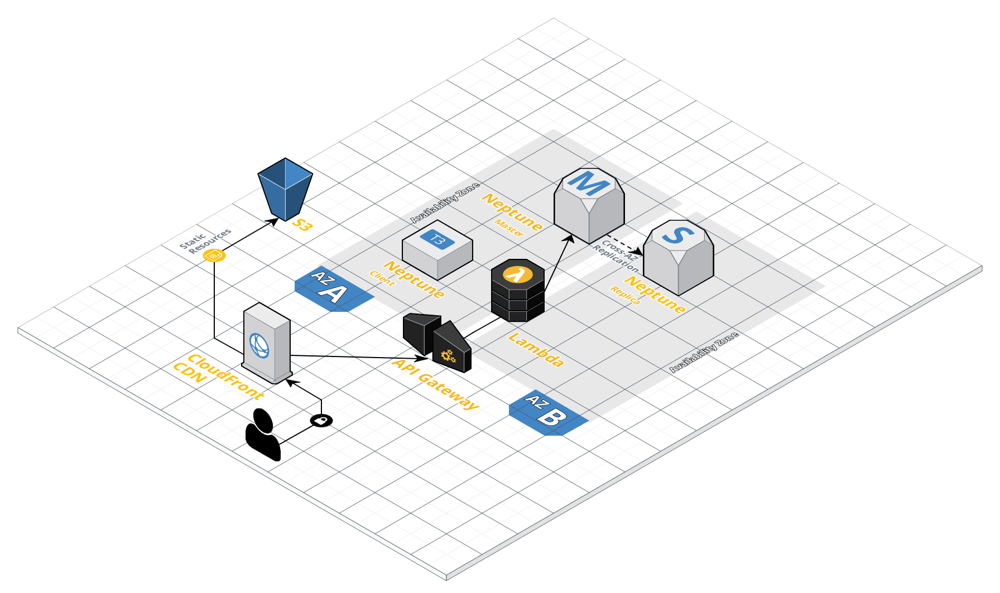

## Shop-by-Style Experience using PyTorch and SageMaker

Contact: [Dylan Tong](mailto:dylatong@amazon.com)

The content in this repository was released as part of a [ML-blog post](https://aws.amazon.com/blogs/machine-learning/a-personalized-shop-by-style-experience-using-pytorch-on-amazon-sagemaker-and-amazon-neptune/): A personalized 'shop-by-style' experience via PyTorch on Amazon SageMaker and Amazon Neptune.

The notebook linked [here](https://github.com/aws-samples/aws-sagemaker-pytorch-shop-by-style/blob/master/notebooks/shop-by-style-model-on-pytorch.ipynb) will provide you a hands-on guide of the entire process involved in building the DL model that powers the solution described in the blog post. 

Additonally, I've provided a one-click deployment for the prototype solution in us-west-2. There are no post-launch configuration steps required. The template will create resources illustrated in the architecture diagram below along with IAM roles. Thus, I recommend deploying this solution with admin permissions in a sandbox or personal account.

The prototype will work in other regions. However, it will require you to make modifications to the CloudFormation template, and copy the provided assets to the other region.

**Allow the template 45-60 minutes to launch. The prototype restores a Neptune database from a snapshot, which can take 45 minutes. As well, CloudFront will require some time before it can redirect traffic to the designated S3 origin. The reason is explained in the [docs](https://docs.aws.amazon.com/AmazonS3/latest/dev/VirtualHosting.html). If you experience an error loading the web pages, allow 20 minutes for DNS propagation to complete.**

Two URLs are provided in the Output section of the CloudFormation Template:

ShoeRackPageURL links you to the primary web page displayed below:

GraphVisURL links you to a graph visualization sample page:

## FAQ

**1. The nested CloudFormation template, microservices.yaml, failed to create. What do I do?**

 The most likely issue is a due to the template being out of date. This template launches a Lambda function, which requires the Node.js version runtime to be specified. You can confirm this issue by disabling automatic rollbacks when you launch the template. If you see an error related to the runtime configurations for the Lambda function, update the template with the current runtimes available for Node.js on Lambda.
 
 **2. The response time for the "ShoeRack" webpage is choppy. What is the issue?**

 The cache needs to warm up. Once you clicked on each image, the images will be cached in CloudFront. The expectations is that most of the images will stay hot in the cache for a large-scale website. There are other optimizations that can be done with the code and database to reduce the reliance on caching.
 
## License

This library is licensed under the Apache 2.0 License. 
